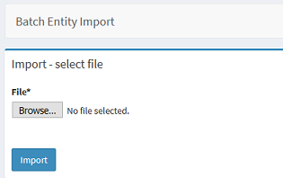
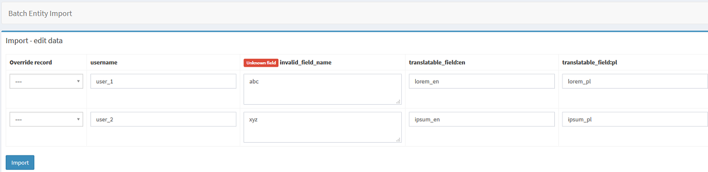

# SonataBatchEntityImportBundle


Bundle is built on top of [BatchEntityImportBundle](https://github.com/jgrygierek/BatchEntityImportBundle).

Importing entities with preview and edit features for Sonata Admin.

* Data can be **viewed and edited** before saving to database.
* Supports **inserting** new records and **updating** existing ones.
* Supported extensions: **CSV, XLS, XLSX, ODS**.
* Supports translations from **KnpLabs Translatable** extension.
* The code is divided into smaller methods that can be easily replaced if you want to change something.
* Columns names are required and should be added as header (first row).
* If column does not have name provided, will be removed from loaded data.




## Documentation

* [Installation](#installation)
* [Configuration class](#configuration-class)
    * [Basic configuration class](#basic-configuration-class)
    * [Fields definitions](#fields-definitions)
    * [Passing services to configuration class](#passing-services-to-configuration-class)
    * [Show & hide entity override column](#show--hide-entity-override-column)
* [Creating admin](#creating-admin)
* [Controller](#controller)
    * [Using configuration class with additional services](#using-configuration-class-with-additional-services)
* [Translations](#translations)
* [Overriding templates](#overriding-templates)

## Installation

Install package via composer:

```
composer require jgrygierek/sonata-batch-entity-import-bundle
```

Add entry to `bundles.php` file:

```
JG\SonataBatchEntityImportBundle\SonataBatchEntityImportBundle::class => ['all' => true],
```

## Configuration class

To define how the import function should work, you need to create a configuration class.

### Basic configuration class

In the simplest case it will contain only class of used entity.

```php
namespace App\Model\ImportConfiguration;

use App\Entity\User;
use JG\BatchEntityImportBundle\Model\Configuration\AbstractImportConfiguration;

class UserImportConfiguration extends AbstractImportConfiguration
{
    public function getEntityClassName(): string
    {
        return User::class;
    }
}
```

### Fields definitions

If you want to change types of rendered fields, instead of using default ones, you have to override method in your import configuration.

To avoid errors during data import, you can add here validation rules.

```php
use JG\BatchEntityImportBundle\Model\Form\FormFieldDefinition;
use Symfony\Component\Form\Extension\Core\Type\IntegerType;
use Symfony\Component\Form\Extension\Core\Type\TextareaType;
use Symfony\Component\Form\Extension\Core\Type\TextType;
use Symfony\Component\Validator\Constraints\Length;

public function getFieldsDefinitions(): array
{
    return [
        'age' => new FormFieldDefinition(
            IntegerType::class,
            [
                'attr' => [
                    'min' => 0,
                    'max' => 999,
                ],
            ]
        ),
        'name' => new FormFieldDefinition(TextType::class),
        'description' => new FormFieldDefinition(
            TextareaType::class,
            [
                'attr' => [
                    'rows' => 2,
                ],
                'constraints' => [new Length(['max' => 255])],
            ]
        ),
    ];
}
```

### Passing services to configuration class

If you want to pass some additional services to your configuration, just override constructor.

```php
public function __construct(EntityManagerInterface $em, TestService $service)
{
    parent::__construct($em);

    $this->testService = $service;
}
```

Then you will need to define this configuration class as a public service too.

### Show & hide entity override column

If you want to hide/show an entity column that allows you to override entity `default: true`, you have to override this method in your import configuration.

```php
public function allowOverrideEntity(): bool
{
    return true;
}
```

## Creating admin

Your admin class should implement `AdminWithImportInterface` and should contain one additional method.

```php
namespace App\Admin;

use App\Model\ImportConfiguration\UserImportConfiguration;
use JG\SonataBatchEntityImportBundle\Admin\AdminWithImportInterface;
use Sonata\AdminBundle\Admin\AbstractAdmin;

class UserAdmin extends AbstractAdmin implements AdminWithImportInterface
{
    public function getImportConfigurationClassName(): string
    {
        return UserImportConfiguration::class;
    }
}
```

## Controller

- If you use default controller, no action is needed. Controller will be replaced automatically.
- If you use your own custom controller, remember that this controller should:
    - extend `JG\SonataBatchEntityImportBundle\Controller\ImportCrudController`
    - or use `JG\SonataBatchEntityImportBundle\Controller\ImportControllerTrait`.

### Using configuration class with additional services

If your import configuration contains some additional services, it has to be visible as a public service. To make it visible in your controller, you have to add
this code:

```php
/**
 * Only add this if u need to allow DI in your configuration class
 * NOTE: make sure the UserImportConfiguration is public
 *
 * @return array<string, string>
 */
public static function getSubscribedServices(): array
{
    return array_merge(
        parent::getSubscribedServices(),
        [
            UserImportConfiguration::class => UserImportConfiguration::class,
        ]
    );
}
```

## Translations

This bundle supports KnpLabs Translatable behavior.

To use this feature, every column with translatable values should be suffixed with locale, for example:

* `name:en`
* `description:pl`
* `title:ru`

If suffix will be added to non-translatable entity, field will be skipped.

If suffix will be added to translatable entity, but field will not be found in translation class, field will be skipped.

## Overriding templates

You have two ways to override templates globally:

- **Configuration** - just change paths to templates in your configuration file. Values in this example are default ones and will be used if nothing will be
  changed.

```yaml
sonata_batch_entity_import:
    templates:
        select_file: '@SonataBatchEntityImport/select_file.html.twig'
        edit_matrix: '@SonataBatchEntityImport/edit_matrix.html.twig'
        button: '@SonataBatchEntityImport/button.html.twig'
```

- **Bundle directory** - put your templates in this directory:

```
templates/bundles/SonataBatchEntityImportBundle
```
